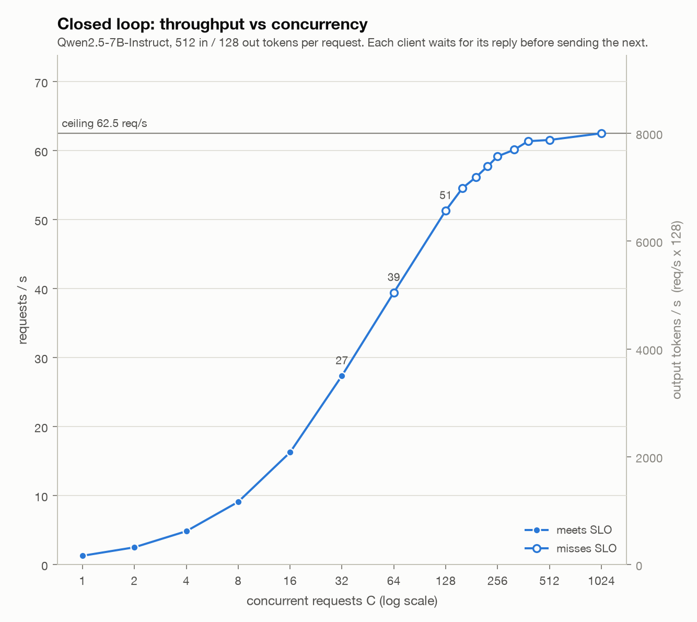
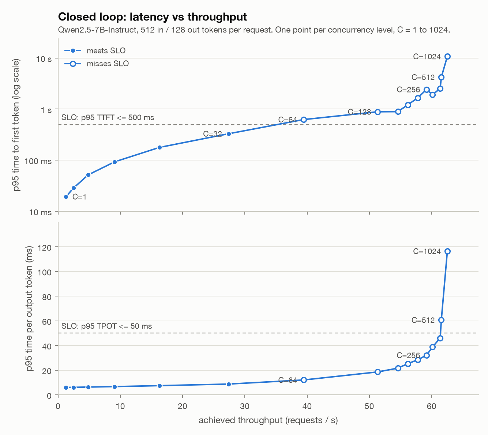
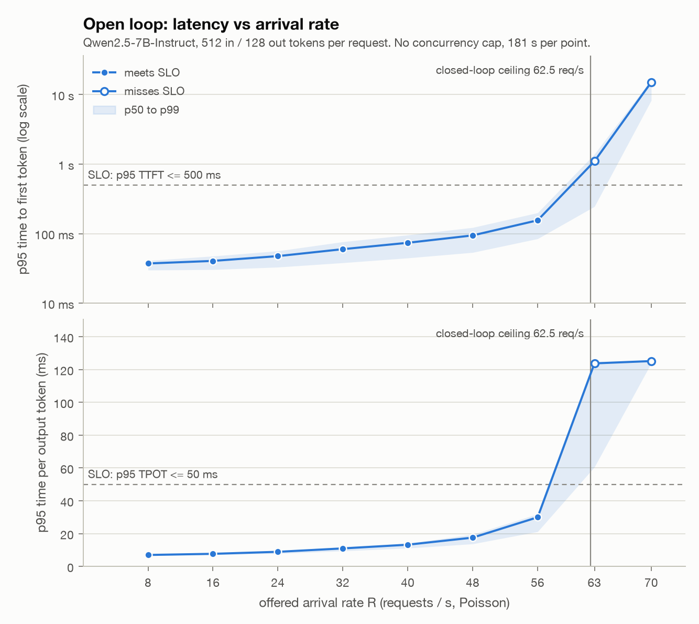
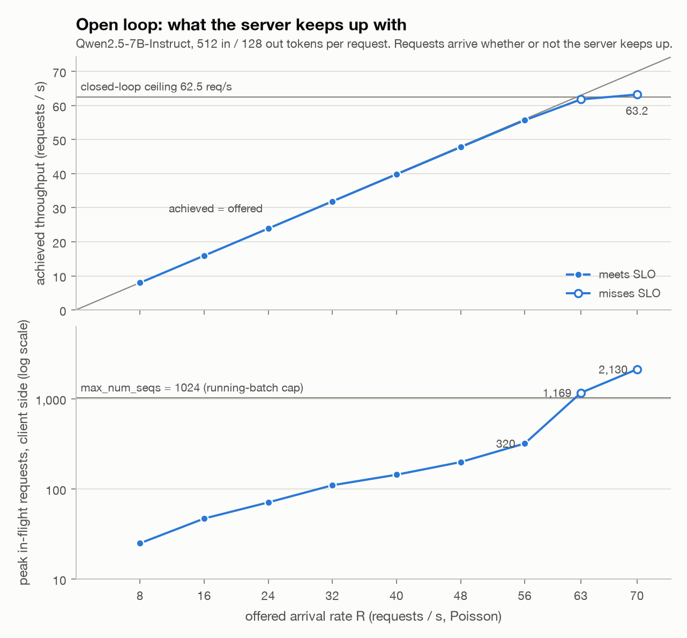
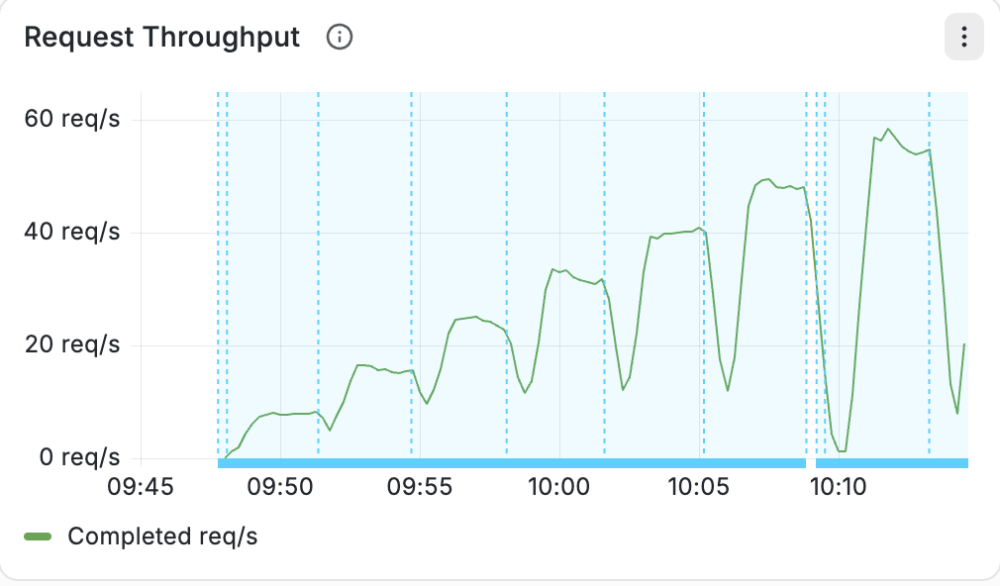
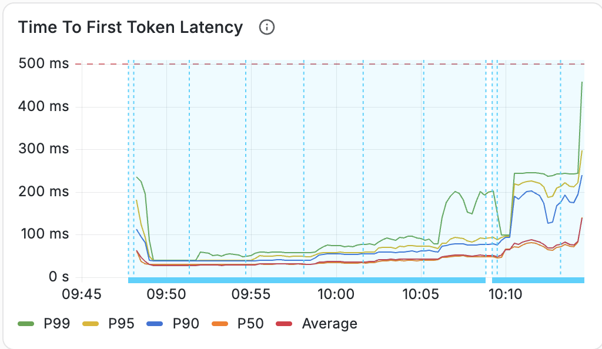
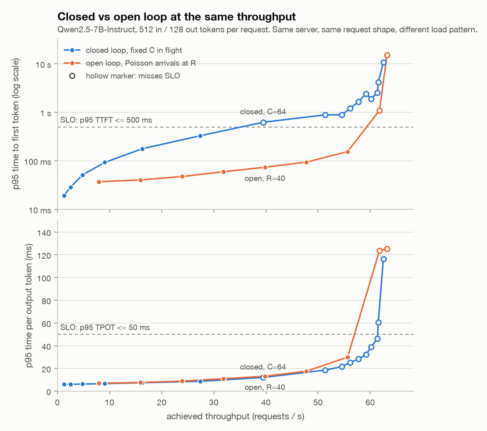
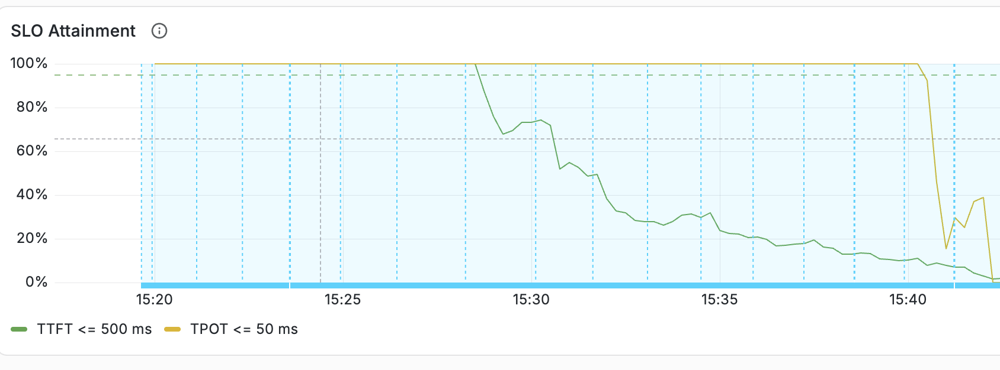
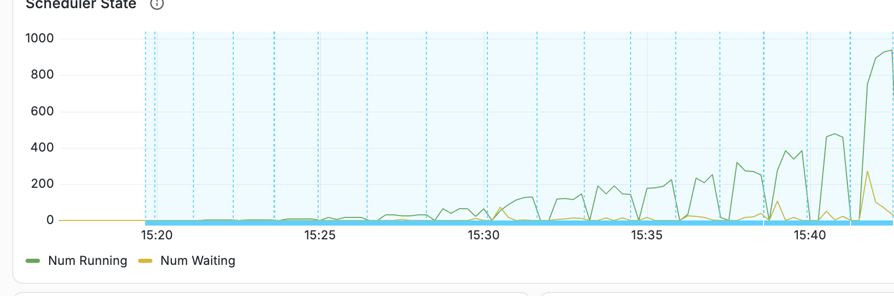
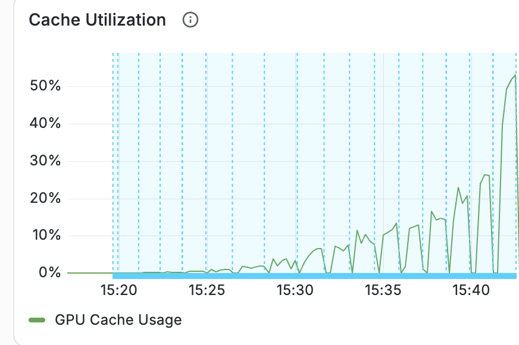

# vLLM serving on one H100

Deploy Qwen2.5-7B-Instruct with vLLM on a single H100, drive it to saturation with closed-loop and open-loop load, and observe it in Grafana while it runs.
Closed loop measures the throughput ceiling.
Open loop measures how much traffic the endpoint can serve within an SLO.

## Setup

| | |
|---|---|
| GPU | 1x NVIDIA H100 80 GB (SXM), Nebius eu-north1, 16 vCPU, 200 GB RAM |
| Launched with | SkyPilot |
| Serving | vLLM 0.29.0, default engine flags |
| Model | Qwen2.5-7B-Instruct: 7.6 B parameters, 15 GB in bf16, about 1 M tokens of KV cache free on the card |
| Request shape | 512 input tokens, 128 output tokens, random prompts, fresh seed per run |

```bash
sky launch -c $USER-serve serve.yaml
sky exec $USER-serve bench.yaml --env MODE=closed --env CS="1 2 4 8 16 32 64 128 160 192 224 256 320 384 512 1024"
sky exec $USER-serve bench.yaml --env MODE=open --env RS="8 16 24 32 40 48 56 63 70"
ssh -N -L 3000:localhost:3000 $USER-serve      # Grafana at localhost:3000
sky down $USER-serve
```

## 1. Closed loop: find the ceiling

**Question.** If we run a pipeline with a fixed worker pool, what do we set the pool size to?

| C | req/s | out tok/s | TTFT p95 | TPOT p95 |
|---|---|---|---|---|
| 1 | 1.3 | 164 | 19 ms | 6 ms |
| 8 | 9.1 | 1163 | 93 ms | 7 ms |
| 32 | 27.4 | 3505 | 329 ms | 9 ms |
| 64 | 39.4 | 5049 | 624 ms | 12 ms |
| 128 | 51.3 | 6569 | 887 ms | 19 ms |
| 256 | 59.2 | 7575 | 2.4 s | 32 ms |
| 512 | 61.6 | 7879 | 4.2 s | 61 ms |
| 1024 | 62.5 | 8002 | 10.7 s | 116 ms |

<p></p>

Throughput climbs steeply up to C=128, then flattens: doubling to 256 adds 8 req/s, doubling again adds 2, and the ceiling is 62.5 req/s.

<p></p>

p95 TTFT crosses the 500 ms bound at C=64, and p95 TPOT crosses the 50 ms bound at C=512.
Past C=128 both curves turn upward while throughput barely moves.

**Pool size.** If each worker keeps one request in flight and sends the next as soon as one comes back, a pool of N workers is exactly the closed loop above with C=N.
So the table already answers the question.
The only thing left to choose is what the pipeline is for.

- **Throughput pipeline.** Nobody is waiting on any one request, you just want the batch done. Use 256 workers. That gets 59 req/s, about 95% of the ceiling.
- **Interactive pipeline.** Every request has to stay under 500 ms p95 TTFT and 50 ms p95 TPOT. Use 32 workers. It is the biggest size we measured that passes, at 27 req/s. At 64 the TTFT bound is already blown at 624 ms. We did not sweep between 32 and 64, so the real limit may sit a little above 32.

Going past 256 workers is wasteful, you have to wait more.
Once throughput has flattened, every extra worker adds about 16 ms to every request in flight and nothing to throughput.
Doubling from 256 to 512 gets 2 more req/s and takes the average request from 4.3 s to 8.3 s.
At 1024 the average request takes 16 s.

## 2. Open loop: find what it can actually serve

**Question.** How much chat traffic can one H100 serve, and where should the autoscaling threshold sit?

**SLO**: p95 TTFT <= 500 ms, p95 TPOT <= 50 ms, and every request completes.

**Method.** Requests arrive as a Poisson process at a fixed rate R with no concurrency cap, 180 s per point.

| R req/s | served req/s | TTFT p95 | TPOT p95 | SLO |
|---|---|---|---|---|
| 8 | 8.0 | 37 ms | 7 ms | pass |
| 16 | 15.9 | 40 ms | 8 ms | pass |
| 24 | 23.9 | 47 ms | 9 ms | pass |
| 32 | 31.9 | 60 ms | 11 ms | pass |
| 40 | 39.8 | 74 ms | 13 ms | pass |
| 48 | 47.8 | 94 ms | 18 ms | pass |
| 56 | 55.7 | 155 ms | 30 ms | pass |
| 63 | 61.8 | 1.1 s | 124 ms | fail |
| 70 | 63.2 | 15.1 s | 125 ms | fail |

<p>
  
  
</p>

Left: both p95 bounds hold through 56 req/s and fail at 63 req/s. The shaded band is p50 to p99.
Right: achieved throughput tracks the offered rate up to the 62.5 req/s ceiling, and peak in-flight requests pass the 1024 batch cap beyond it.

<p>
  
  
</p>

Throughput follows the offered rate step for step, and TTFT p95 stays under 300 ms through 56 req/s. The spike at the right edge is the 63 req/s point starting.

**Findings.**

- **One H100 serves 56 req/s inside the SLO.** At 63 req/s, just under the ceiling, everything breaks at once: TTFT p95 jumps to 1.1 s, TPOT p95 to 124 ms, and 2 requests fail. At 70 req/s the server tops out at 63 req/s and the queue grows without bound, the same ceiling the closed loop found.
- **Autoscale at 70% of that.** Add a replica when a replica's smoothed request rate stays above 39 req/s for two minutes. Requests piling up in the waiting queue are the earliest warning.
- **Real traffic does better than the closed loop suggested.** At about 40 req/s, p95 TTFT is 74 ms open loop and 624 ms closed loop. Closed-loop clients send identical requests in lockstep, so every prompt queues behind C-1 others for prefill. Poisson arrivals spread prefill out over time.

<p>
  
</p>

Near 40 req/s, open-loop p95 TTFT is 74 ms against 624 ms in closed loop, while p95 TPOT is the same in both modes.
Only the queueing ahead of prefill differs, not the decode work per step.

## 3. Observability

<p>
  
</p>
<p>
  
  
</p>

Top: the TTFT bound fails from about C=64, while the TPOT bound holds until C=512.
Bottom: the running batch grows with C, the queue spikes only at the start of each point, and KV cache usage stays below 60%.

**What each metric tells us.**

- Time to first token versus time per output token. TTFT is queueing plus prefill and is bound by compute. TPOT is the decode step time and is bound by memory bandwidth. They degrade for different reasons, so they are tracked separately. Inter-token latency adds a third view: it exposes stalls when a burst of prefill displaces a decode step.
- Requests per second versus output tokens per second. Requests per second is the unit for capacity planning and autoscaling once the request shape is known. Tokens per second is the unit for GPU efficiency and for comparing different shapes.
- Queue depth versus batch size. In closed loop the batch is pinned at C and the queue stays empty. In open loop the queue stays empty until the arrival rate approaches capacity, then grows without bound.
- KV cache utilization. It stayed below 60% in this exercise. When the cache fills, vLLM preempts running requests, per-token latency stalls, and the queue grows.
- Client-side versus Prometheus percentiles. The client computes percentiles from every observed sample. Prometheus interpolates within fixed histogram buckets, so its value is approximate unless the threshold falls on a bucket boundary. The SLO bounds of 500 ms and 50 ms were chosen to sit on those boundaries.

## Files

| Path | Contents |
|---|---|
| `serve.yaml`, `scripts/` | Cluster definition, vLLM startup, metrics stack, benchmark runner |
| `bench.yaml` | Closed-loop and open-loop sweeps, one JSON file per point |
| `observability/` | Prometheus and Grafana configuration and the dashboard |
| `results/` | Raw benchmark output |
| `screenshots/closed/`, `screenshots/open/` | Grafana panel captures from each sweep, one per panel |
| `plots/` | Curves from `results/`, generated by `uv run scripts/plot.py` |
